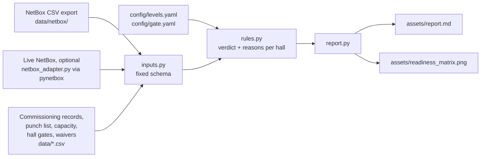
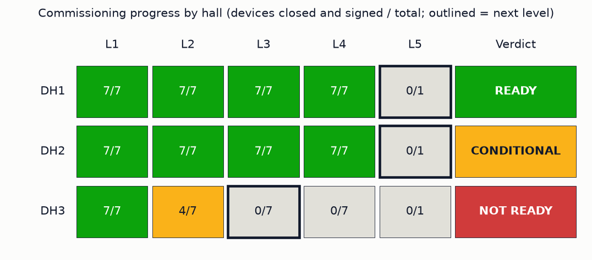

# Commissioning Readiness Gate

 [](https://codecov.io/gh/alexc-hue/commissioning-readiness-gate) [](LICENSE) 

For each data hall, this answers one question: can the hall start its next
commissioning level now, and if not, why not? It reads the hall's assets
from NetBox, the commissioning records, the punch list and a capacity
figure, and gives a ready / conditional / not-ready verdict. Every verdict
comes with its reasons.

> **Synthetic practice model.** Every hall, device, test record and punch
> item in this repo is made up. The asset list is shaped like a NetBox
> export and a few device types are real entries from NetBox's device-type
> library, but the site doesn't exist. This is a model of how readiness
> gates can be checked, not a record of real data-center commissioning work.

Part of a small project-controls toolkit:
[project-controls-dashboard](https://github.com/alexc-hue/project-controls-dashboard),
[schedule-health-analyzer](https://github.com/alexc-hue/schedule-health-analyzer),
[change-control-register](https://github.com/alexc-hue/change-control-register),
[risk-trend-tracker](https://github.com/alexc-hue/risk-trend-tracker),
[project-controls-reporting-engine](https://github.com/alexc-hue/project-controls-reporting-engine),
[recovery-scenario-planner](https://github.com/alexc-hue/recovery-scenario-planner),
[facility-status-digital-twin](https://github.com/alexc-hue/facility-status-digital-twin),
**commissioning-readiness-gate** (this repo).

## Where this comes from

My delivery work has been automation systems on offshore drilling
programmes, where FAT, SAT and release gates decided when a system was
allowed to move to the next stage. I haven't commissioned a data center. This repo
takes that gate discipline and applies it to the L1 to L5 commissioning
sequence data halls use, as practice.

## What this is not

- Not a DCIM tool. Assets are read from NetBox, never edited, and nothing
  here tracks rack elevations, cabling or asset lifecycle.
- Not an MEP or electrical engineering assessment. The capacity check
  compares recorded numbers; it doesn't model anything.
- Not a commissioning authority's tool. It doesn't hold test scripts or
  test results, only whether each level is recorded closed and signed.
- Not evidence of data-center delivery experience (see above).

## Problem

Before a data hall can move to its next commissioning level, someone has to
check that every piece of equipment has closed the levels before it, that
nothing on the punch list blocks the step, and, from first energisation
onward, that the IT load the hall is designed for fits the power and cooling
actually provisioned. That check usually lives across a Cx tracker, a punch
list spreadsheet and an asset register, and gets done by hand the week
before the milestone.

## Approach

Each hall has a target: the next level it is planned to start, with a
planned date (`data/hall_gates.csv`). The gate rules (`src/rules.py`) then
check the hall against that target:

| Rule | Effect | What it checks |
|---|---|---|
| SEQUENCE | blocks | A level recorded closed on a device while an earlier level on that device isn't. No skipping. |
| PREREQ | blocks | Every device has closed every level before the target. For IST (L5), that means every device's L4. A closed record with no signature doesn't count. |
| WAIVED | conditional | A PREREQ gap covered by a waiver. Only when waivers are switched on in `config/gate.yaml` (off by default); never better than conditional. |
| PUNCH_A | blocks | Open category A punch items in the hall. |
| PUNCH_B | conditional | Open category B items: must close before handover, don't stop the next level. |
| PUNCH_C | info | Open category C items, reported only. |
| CAPACITY | blocks | From the energisation level (L3) onward: the hall's design IT load, summed from its racks, above provisioned power or provisioned cooling. |

Any blocking reason gives not-ready, otherwise any conditional reason gives
conditional, otherwise ready.

## Architecture



The CSV export and the live adapter produce the same schema, and a test
checks that they do on the same assets, so the rules can't tell the two
apart. Nothing is ever written to NetBox.

## Result

Running `gate.py` against the sample data:

```
Commissioning readiness as of 2026-10-05 (site DC-Sample, 3 halls)

DH1  next: L5 Integrated systems testing (IST), planned 2026-11-02 (28 days)  READY
DH2  next: L5 Integrated systems testing (IST), planned 2026-11-16 (42 days)  CONDITIONAL
  - PUNCH_B: 2 open category B punch items (P-201, P-202)
DH3  next: L3 Pre-functional and start-up, planned 2026-10-19 (14 days)  NOT READY
  - SEQUENCE: DH3-CRAH-02: L3 recorded closed while L2 is open
  - PREREQ: DH3-UPS-01: L2 open, needed before L3
  - PREREQ: DH3-CRAH-02: L2 open, needed before L3
  - PREREQ: DH3-PDU-R02: L2 closed but unsigned, needed before L3
  - PUNCH_A: 1 open category A punch item (P-301)
  - CAPACITY: design IT load 300 kW exceeds provisioned cooling 280 kW

Wrote assets/report.md
Wrote assets/readiness_matrix.png
```

DH3 is the interesting one: two weeks from first energisation, one unit
already has its start-up recorded as done while its installation check is
still open, one signature is missing, and the racks it's designed for need
more cooling than the hall has. Each of those would normally surface in a
different document. The full report, including info-level reasons and level
progress per hall, is in [assets/report.md](assets/report.md).



## Commissioning levels

The default levels in `config/levels.yaml`:

| Level | Name | Scope |
|---|---|---|
| L1 | Factory acceptance | Each piece of equipment, at the factory |
| L2 | Delivery and installation verification | Each piece of equipment, on site, unpowered |
| L3 | Pre-functional and start-up | Each piece of equipment, first power-up (energisation) |
| L4 | Functional performance testing | Each system against its sequence of operation |
| L5 | Integrated systems testing (IST) | The whole hall together at simulated design load, with failure scenarios |

The L1 to L5 numbering is industry convention, not a standard, and sources
don't fully agree on what each level covers. One describes L2 as site
acceptance testing, another as delivery and static inspection, and some
firms use levels 0 to 6. So the levels are a config file: edit it to match
the project's own Cx plan. The gate logic only uses their order and which
level is energisation. Sources for the defaults:

- [Anvilfield: data center commissioning levels and process field guide](https://anvilfield.com/field-guides/datacenter/data-center-commissioning-levels-process/)
- [A3A Engenharia: data center commissioning, L1 to L5 levels, IST and acceptance](https://a3aengenharia.com/en-us/content/technical-articles/data-center-commissioning-tests-levels-acceptance-criteria/)
- [PCM: data center commissioning levels, L1 to L5 explained](https://projectcm.com.au/expertise/data-center-commissioning-levels)
- [Archdesk: data center commissioning, L1 to L5 explained](https://archdesk.com/blog/data-center-commissioning-levels)

## Assumptions a commissioning agent would challenge

- The level definitions are a generic convention, not a project's Cx plan.
- Strict sequencing (no level closes before the one below it) is stricter
  than many real projects run, where some L3 work overlaps late L2 items.
  Waivers exist for that, but they're off by default.
- "Closed" means a status and a signature. Real closure depends on the
  evidence behind it (witnessed scripts, load bank records, BMS and EPMS
  trend data), none of which is modelled here.
- IST is recorded as one hall-level pass or fail. It isn't derived from
  test data, and failure scenarios aren't represented.
- The capacity check sums design IT load per rack and compares it with two
  provisioned numbers. It ignores diversity, redundancy topology (N+1, 2N),
  mechanical load, and load bank planning.
- Punch categories are simplified to A (blocks the next level), B (before
  handover) and C (cosmetic). Real punch lists often grade differently.
- Big plant (switchboards, UPS modules, CRAH units) is listed as NetBox
  devices with generic device types. Plenty of sites don't track that plant
  in NetBox at all.
- Sign-off roles in `levels.yaml` are placeholders.

## Limitations

- Size-tested with `benchmarks/size_test.py` by repeating the sample halls,
  on a 2018 laptop (Intel i7-8750H, Python 3.14), single runs, so treat the
  numbers as a guide: 30 halls (210 devices) run in about 2 seconds, 300
  halls in about 6 and 1,000 halls in about 20, using around 150 MB. The
  readiness chart shows the 30 halls furthest from ready; report.md covers
  every hall.

## Run it

```bash
pip install -r requirements.txt
python gate.py
```

Inputs, all keyed to NetBox IDs:

- `data/netbox/devices.csv`, `data/netbox/racks.csv`: NetBox's own table
  export (Devices and Racks lists, Export > Current view) with at least ID,
  Name, Status, Site, Location, Rack, Role, Manufacturer and Type visible.
  Each NetBox Location is treated as one hall.
- `data/commissioning.csv`: one row per device and level (device ID blank
  for the hall-level L5), with status, who signed and when.
- `data/punch_list.csv`, `data/hall_capacity.csv`,
  `data/rack_design_load.csv`, `data/hall_gates.csv`, `data/waivers.csv`.
- `config/levels.yaml` (levels and their order), `config/gate.yaml`
  (status date, site, waivers on or off).

To read devices and racks from a live NetBox instead of the export, install
pynetbox and point the tool at it (read-only; the token comes from the
environment):

```bash
pip install pynetbox
NETBOX_TOKEN=... python gate.py --netbox-url https://netbox.example.com --site-slug dc-sample
```

The tests run the adapter against NetBox-shaped API responses in
`tests/fixtures/netbox_api/`, so CI doesn't need a NetBox server.

To see how it copes with sites with more halls, run `python
benchmarks/size_test.py`. It prints run time and peak memory at each size.
It's a hand-run check, not part of the test suite; measured numbers are
under Limitations.
